# TODO Resolution Plan - PR #34 Code Review

## Dependency Flow

```mermaid
graph TD
    A["🔴 P1-001: MD5→SHA256 Security Fix"] --> B["✅ P1-001: Verify Tests Pass"]
    C["🔴 P1-002: Create AGENT_API.md Docs"] --> D["✅ P1-002: Verify Agent Guide Complete"]
    E["🟡 P2-003: Team Decision on Phase 2-3"] --> F["✅ P2-003: Implement Decision"]
    B --> G["Final: Commit & Push"]
    D --> G
    F --> G

    style A fill:#ff6b6b
    style C fill:#ff6b6b
    style E fill:#ffd93d
    style B fill:#51cf66
    style D fill:#51cf66
    style F fill:#51cf66
    style G fill:#4c6ef5
```

## Resolution Strategy

### Phase 1: Parallel Work (No Dependencies)
These can be done simultaneously:

1. **P1-001: Security Fix (MD5 → SHA256)** - 5 minutes
   - File: `api/app/models/sprint.rb:130`
   - Change one line of code
   - Run tests to verify
   - **Status:** Starting now

2. **P1-002: Agent API Documentation** - 4 hours
   - Create: `docs/AGENT_API.md`
   - Document ETag caching with examples
   - **Status:** Starting now in parallel

3. **P2-003: Architecture Decision** - 1 hour
   - Team decides: Keep Phase 2-3 or remove?
   - **Status:** Awaiting team input

### Phase 2: Sequential (Depends on Phase 1 Results)

4. **Verify Tests Pass** - Depends on P1-001
   - Run full test suite after MD5 change
   - Should see all 113 tests pass
   - **Status:** Blocked until P1-001 complete

5. **Implement Architecture Decision** - Depends on P2-003
   - If removing Phase 2-3: Remove code + tests
   - If keeping: Add documentation
   - **Status:** Blocked until P2-003 decision

### Phase 3: Final

6. **Commit & Push** - Depends on all above
   - All fixes implemented
   - All tests passing
   - Documentation complete
   - Decision documented
   - **Status:** Final step

## Execution Plan

### ✅ IMMEDIATE (Start Now - Parallel)

**Task 1: PR Comment Resolver - Security Fix**
- File: `api/app/models/sprint.rb:130`
- Change: `Digest::MD5` → `Digest::SHA256`
- Add: Test verification

**Task 2: PR Comment Resolver - Agent Documentation**
- Create: `docs/AGENT_API.md`
- Include: ETag examples, Python/JS code, force_refresh docs

**Task 3: Team Discussion**
- Decision needed: Keep or remove Phase 2-3?
- Reference: `003-pending-p2-architecture-premature-phase2-phase3.md`

### ⏳ AFTER PHASE 1

**Task 4: PR Comment Resolver - Remove Phase 2-3 (if decided)**
- Remove: `sprint.rb:generate_cache_key` method
- Remove: `sprints_controller.rb` ETag logic
- Remove: Database migration
- Remove: HTTP caching tests

**Task 5: Final Test & Commit**
- Run: `bundle exec rails test`
- Commit: All changes
- Push: To origin

## Status Tracking

| Item | Priority | Status | Owner | ETA |
|------|----------|--------|-------|-----|
| P1-001: MD5→SHA256 | 🔴 P1 | ▶️ In Progress | Agent | 5 min |
| P1-002: AGENT_API.md | 🔴 P1 | ▶️ In Progress | Agent | 4 hours |
| P2-003: Phase 2-3 Decision | 🟡 P2 | ⏳ Waiting | Team | 1 hour |
| Verify Tests | ✅ Depends | Blocked | Agent | 5 min |
| Implement Decision | ✅ Depends | Blocked | Agent | 2 hours |
| Final Commit | ✅ Depends | Blocked | Agent | 10 min |

**Total Time (Critical Path):** ~8 hours (mostly for AGENT_API.md documentation)

## Next Steps

1. ✅ Start P1-001 & P1-002 in parallel now
2. ⏳ Team makes decision on P2-003
3. ✅ Verify tests pass after security fix
4. ✅ Implement architecture decision
5. ✅ Final commit and push

